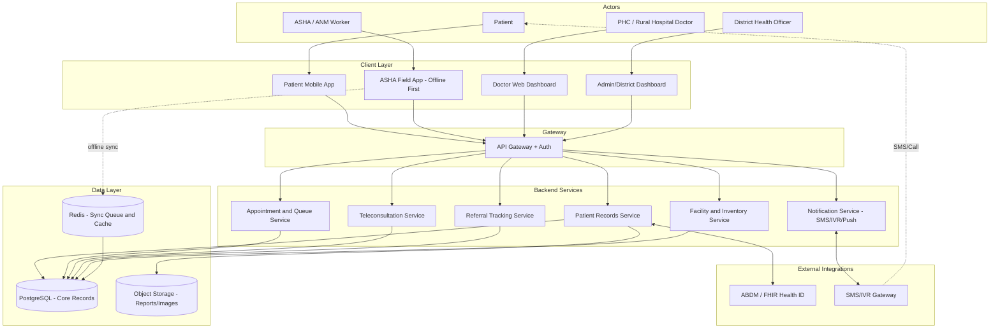
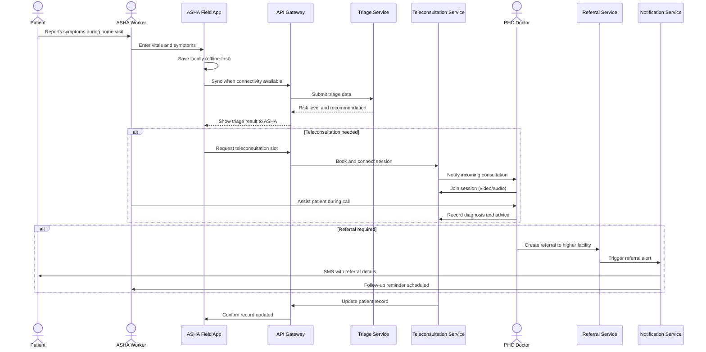

# ARCHITECTURE — SwasthyaSetu (SIH26133)

---

## 1. High-Level System Architecture (Overview)

The system is organized into four layers:

- **Client Layer** — A patient-facing mobile app (usable by patients directly or assisted by an ASHA worker), an ASHA/ANM field-worker app with offline data capture, a doctor/PHC web dashboard for teleconsultation and triage review, and a district admin dashboard for monitoring. All apps talk to the backend through a single API gateway.
- **API / Backend Layer** — A set of backend services (Patient Records, Appointment & Queue, Referral Tracking, Teleconsultation, Notification, Facility/Inventory) sitting behind an API gateway. Each service owns its own responsibility so the system can scale and be extended module-by-module.
- **Data Layer** — A central PostgreSQL database for structured health and facility records, Redis for queues/caching and offline-sync conflict resolution, and object storage for attachments (reports, images).
- **External Integration Layer** — Integration points for Ayushman Bharat Digital Mission (ABDM) for health ID and record interoperability, an SMS/IVR gateway for low-connectivity fallback, and (optionally) state health department reporting systems.

Data always flows through the API gateway — no client talks directly to the database — which keeps security, validation, and offline-sync conflict resolution centralized in one place.

---

## 2. System Architecture Diagram

---

## 3. Core User Flow — Sequence Diagram (Assisted Teleconsultation)

The most central flow is an ASHA-assisted patient visit leading to teleconsultation and, if needed, a referral.

---

## 4. Data Flow — Field to Central Dashboard

1. **Capture at the field** — ASHA/ANM worker records vitals, symptoms, and history on the field app during a home or sub-centre visit; the entry is saved locally first regardless of network availability.
2. **Local queuing** — Entries are queued on-device (local SQLite) until a network connection is detected.
3. **Sync to backend** — On connectivity, the app pushes queued records through the API gateway; a conflict-resolution layer (Redis-backed) merges any updates against the central record using timestamps and record versioning.
4. **Central storage** — Validated records are written to PostgreSQL and linked to the patient's longitudinal health record (tied to their ABDM health ID where available).
5. **Consumption by upper layers** — PHC doctors see the updated record when the patient is triaged or referred; referral status updates flow back down to the ASHA app and to the patient via SMS.
6. **Aggregation for dashboards** — Facility and district dashboards query aggregated, de-identified views of the same central data for monitoring — never raw patient-identifiable data unless the officer has explicit role-based access.

---

## 5. Offline-First / Low-Bandwidth Design

- **Local-first data capture**: the ASHA field app writes to an on-device database first; the network is treated as best-effort, not a dependency for basic functionality.
- **Queued, incremental sync**: only changed records sync, in small payloads, to minimize data usage on limited rural connectivity.
- **Conflict resolution**: last-write-wins with versioning for simple fields; flagged-for-review for conflicting clinical entries, avoiding silent data loss.
- **SMS/IVR fallback**: appointment confirmations, referral alerts, and follow-up reminders are deliverable over SMS/IVR for patients without smartphones or data connectivity, not just push notifications.
- **Lightweight app footprint**: minimal media/asset sizes, compressed payloads, and low-end-device compatibility for widely-used entry-level Android phones.
- **Progressive data loading**: dashboards and doctor views load summarized data first, with full record detail fetched only on demand.

---

## 6. Security & Data Privacy Considerations

- **DPDP Act, 2023 compliance**: patient health data is treated as sensitive personal data; explicit consent is captured before collection, and purpose-limited processing is enforced.
- **Role-based access control (RBAC)**: ASHA workers, doctors, and district officers each see only the data scope relevant to their role — officers see aggregated/de-identified data by default.
- **Encryption**: data encrypted in transit (TLS) and at rest in the database and object storage.
- **Health ID / ABDM alignment**: leverages ABDM consent-manager framework so patients control which facilities can access their records, rather than the platform holding unilateral access.
- **Audit logging**: every access to a patient's full record is logged for accountability, especially for referral and teleconsultation actions.
- **Data minimization**: SMS/IVR messages carry only non-sensitive identifiers (e.g., referral token) rather than full clinical details.

---

## 7. Scalability Considerations (State-Level Rollout)

- **Microservice-style backend** allows individual services (e.g., Notification, Teleconsultation) to be scaled independently as load grows district-by-district.
- **API gateway + stateless services** support horizontal scaling behind a load balancer as more districts onboard.
- **District-wise data partitioning** (logical, not necessarily physical) keeps queries fast even as the state-wide patient base grows.
- **Async processing via queues** (Redis/message broker) for non-urgent tasks like SMS dispatch and dashboard aggregation, preventing load spikes from affecting core patient-facing flows.
- **CDN/caching** for static dashboard assets and read-heavy aggregated views.
- **Phased rollout model**: pilot in a few PHCs → block-level → district-level → state-level, matching how Maharashtra's health administration is already structured, so scaling follows an existing administrative hierarchy rather than a new one.

---

## 8. Module-Wise Breakdown

| Module | Responsibility |
|---|---|
| **Patient Mobile App** | Lets patients view their own health record, book appointments, join teleconsultations, and receive reminders directly, where smartphone access exists. |
| **ASHA/ANM Field App** | Offline-first data capture during home visits — vitals, symptoms, triage entry, and assisted teleconsultation initiation for patients without devices. |
| **Doctor/PHC Dashboard** | Lets doctors review triage results, conduct teleconsultations, record diagnoses, and initiate referrals to higher facilities. |
| **Admin/District Dashboard** | Gives district health officers a live view of facility load, referral completion rates, high-risk patient follow-up status, and medicine/diagnostic availability. |
| **Appointment & Queue Service** | Manages slot booking and real-time queue status across PHCs and rural hospitals to reduce patient wait times. |
| **Teleconsultation Service** | Handles video/audio session setup, scheduling, and recording of consultation outcomes. |
| **Referral Tracking Service** | Tracks a referral's full lifecycle — initiated, in-transit, received, completed — so no case is lost between facility levels. |
| **Facility & Inventory Service** | Maintains real-time visibility into medicine stock and diagnostic test availability per facility. |
| **Notification Service** | Delivers reminders, referral alerts, and confirmations via push notification, SMS, or IVR depending on the patient's connectivity/device profile. |
| **Sync & Conflict Resolution Layer** | Reconciles offline-captured field data with the central record when connectivity is restored, flagging conflicting entries for review. |
